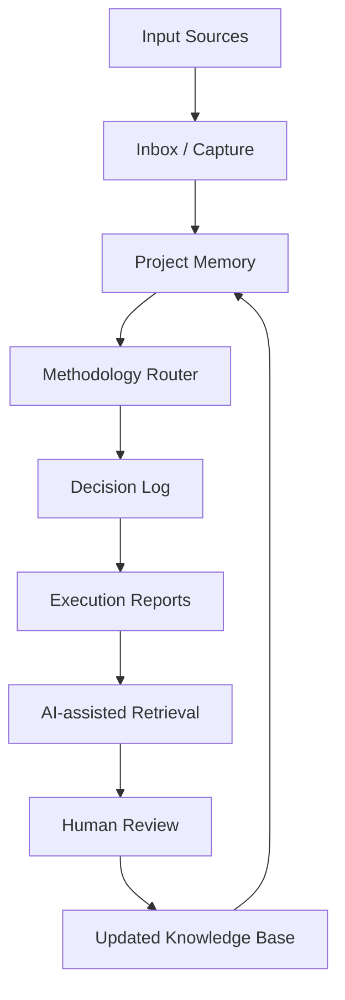

# Super Brain 2.0

## Portfolio Note

This repository is a public-safe portfolio case prepared by QIAN Boyu (Bowie) for graduate applications in AI, enterprise AI systems, and the SUTD MSc in Design and Artificial Intelligence for Enterprise.

The project presents Super Brain 2.0 as a personal AI-assisted knowledge and decision-management system. It is documented here as a portfolio-safe concept and workflow case, not as a fully deployed enterprise product.

## Project Summary

Super Brain 2.0 is an AI-assisted knowledge and decision-management system designed to organize projects, methodologies, execution reports, workflows, and AI-assisted reasoning.

The system turns scattered notes, AI conversations, project decisions, and execution records into a structured knowledge environment. Its focus is not traditional software engineering alone, but knowledge architecture, workflow documentation, methodology routing, and human-AI decision support.

## Problem Context

As personal projects multiply, knowledge becomes fragmented. AI conversations, decisions, execution reports, and project methods are easily lost across tools and time.

Without structure, AI-assisted work becomes hard to audit, retrieve, reuse, or explain. A second brain system can turn scattered work into reusable decision infrastructure by preserving context, routing work to suitable methodologies, and creating a disciplined write-back loop.

## My Role

Founder / Knowledge System Designer / AI Workflow Designer

Responsibilities:

- Problem framing
- Knowledge architecture design
- Methodology routing concept
- Workflow documentation
- Project memory structure
- Public-safe portfolio documentation

## Current Implementation Status

Completed:

- Knowledge system framing
- Public-safe architecture
- Methodology routing concept
- Project memory structure
- Workflow documentation approach
- Personal project management use case

In Progress:

- Web-based cockpit/interface
- Better retrieval and indexing
- More structured project templates
- Cross-project methodology library
- Enterprise knowledge management adaptation

Not Included Publicly:

- Private notes
- Private conversations
- Internal execution reports
- Trading-sensitive materials
- Client/customer information
- API keys/tokens
- Private prompts
- Full local second brain contents

## Repository Structure

```text
super-brain-2/
├── README.md
├── docs/
│   ├── project-overview.md
│   ├── system-architecture.md
│   ├── workflow.md
│   ├── methodology-router.md
│   ├── knowledge-governance.md
│   ├── sample-structure.md
│   ├── evaluation-rubric.md
│   ├── product-roadmap.md
│   └── sutd-fit.md
└── assets/
    └── README.md
```

- `docs/project-overview.md`: problem, users, AI value, human review, role, and portfolio boundary.
- `docs/system-architecture.md`: high-level architecture and system layers.
- `docs/workflow.md`: end-to-end operating workflow.
- `docs/methodology-router.md`: routing concept and synthetic examples.
- `docs/knowledge-governance.md`: public/private boundaries and responsible knowledge practices.
- `docs/sample-structure.md`: simplified synthetic second-brain structure for demonstration.
- `docs/evaluation-rubric.md`: criteria for evaluating system quality.
- `docs/product-roadmap.md`: staged development path.
- `docs/sutd-fit.md`: connection to SUTD DAI-E.
- `assets/README.md`: rules for future public-safe assets.

## System Overview



## Core Workflow


## Responsible Knowledge Governance

Super Brain 2.0 uses an explicit public/private boundary. Public documentation only contains safe descriptions, diagrams, synthetic examples, and portfolio-safe explanations. Private notes, sensitive project data, personal journals, financial records, client information, API keys, tokens, and internal commercial materials are intentionally excluded.

The system is designed around source traceability, human review, versioned decisions, and disciplined write-back. AI can assist retrieval, structuring, summarization, and reasoning, but the human operator remains responsible for judgment, approval, and sensitive-data handling.

## Relevance to SUTD MSc DAI-E

This project connects directly with the SUTD MSc in Design and Artificial Intelligence for Enterprise through:

- Design-led system framing
- Human-AI collaboration
- Enterprise knowledge workflows
- AI-assisted decision support
- Responsible knowledge governance
- Workflow architecture

It reflects my development direction as an AI systems builder and enterprise AI workflow designer with a psychology background, focused on how humans structure, trust, retrieve, and reuse AI-assisted knowledge.

## Next Steps

- Build a lightweight web cockpit
- Add structured templates
- Improve search/retrieval
- Create a methodology library
- Test enterprise knowledge-management adaptation
- Prepare public-safe demo screenshots later
