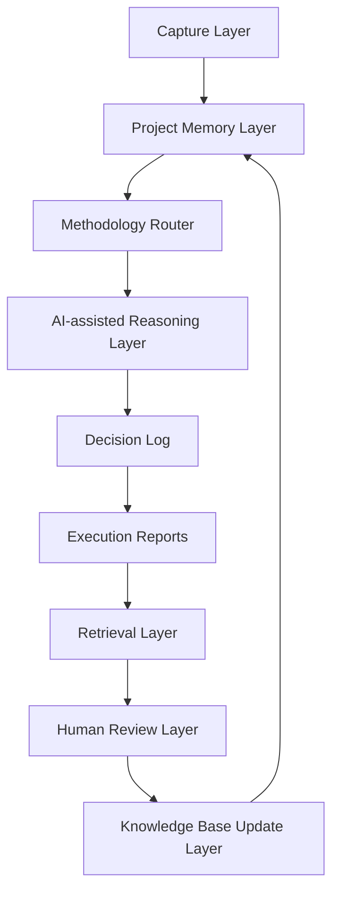

# System Architecture

## High-Level Architecture

Super Brain 2.0 is designed as a layered knowledge and decision-management system. Each layer has a clear responsibility: capture information, structure it, route it to relevant methods, preserve decisions, support retrieval, and update the knowledge base after human review.

## Capture Layer

The capture layer collects raw inputs before they are structured. Inputs may include meeting notes, project thoughts, AI conversation summaries, task records, research snippets, or execution observations.

The purpose of this layer is to prevent useful context from being lost.

## Project Memory Layer

The project memory layer organizes information by project, status, decision history, methods used, open risks, and next actions.

Instead of treating each note as isolated, the system connects information to a project lifecycle.

## Methodology Router

The methodology router helps decide which thinking pattern or workflow should be applied to a new input. For example, a product design issue may be routed differently from an incident review or a knowledge governance question.

The router is not meant to replace judgment. It provides a first recommendation that the human operator can accept, modify, or override.

## AI-Assisted Reasoning Layer

This layer uses AI to assist with clarification, summarization, comparison, decomposition, and reasoning.

Possible outputs include:

- Structured summaries
- Decision options
- Risk lists
- Reusable templates
- Follow-up questions
- Draft execution reports

## Decision Log

The decision log records important decisions, rationale, alternatives considered, date, status, and follow-up requirements.

The goal is to make decisions retrievable and auditable instead of hidden inside chat history or scattered notes.

## Execution Reports

Execution reports document what was done, what changed, what worked, what failed, and what should be updated in the knowledge base.

They create the feedback loop between action and system memory.

## Retrieval Layer

The retrieval layer helps locate prior decisions, related methods, project context, and relevant source material.

Future versions may include indexing, semantic search, tagging, and a web-based cockpit.

## Human Review Layer

Human review checks correctness, relevance, sensitivity, and actionability.

This layer is especially important because AI-generated summaries and recommendations may be incomplete, outdated, or contextually wrong.

## Knowledge Base Update Layer

After review, accepted information is written back into the knowledge base. This creates a living system that improves as projects are executed.

## Limitations

Current limitations include:

- No public web cockpit yet
- Limited automated retrieval in the public version
- No public demo screenshots yet
- Synthetic examples only
- No private project data included
- No claim of enterprise deployment
