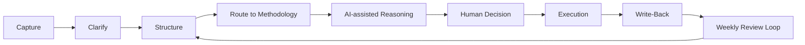

# Workflow

## 1. Capture

New information enters the system through an inbox. This may include project notes, AI conversation summaries, research snippets, task outcomes, decisions, or unresolved questions.

The goal is fast capture without losing context.

## 2. Clarify

Captured information is clarified before being placed into long-term memory.

Typical clarification questions:

- What project does this belong to?
- Is this an idea, decision, task, incident, source, or report?
- Is there any sensitive information that must stay private?
- What is the next useful action?

## 3. Structure

The information is transformed into a structured format. This may include title, project, date, status, source, decision, rationale, risks, and follow-up.

Structured knowledge is easier to retrieve and reuse.

## 4. Route to Methodology

The system identifies which methodology should guide the next step.

Examples:

- Product design workflow
- Enterprise workflow analysis
- Knowledge governance review
- Trading research review
- Content production workflow
- Project retrospective
- Risk and incident review

## 5. AI-Assisted Reasoning

AI assists by summarizing, decomposing, comparing, drafting, and surfacing questions.

AI outputs are treated as working material, not final truth.

## 6. Human Decision

The human operator reviews AI-assisted reasoning and makes the final decision.

The decision may include:

- Selected option
- Rationale
- Rejected alternatives
- Risks
- Follow-up tasks
- Review date

## 7. Execution

The selected decision is converted into action. Execution may involve building a document, testing a workflow, updating a template, creating a project artifact, or reviewing a process.

## 8. Write-Back

After execution, the result is written back into the system.

Write-back may include:

- What was completed
- What changed
- What was learned
- What should be reused
- What should be revised
- What remains unresolved

## 9. Weekly / Review Loop

A regular review loop checks open decisions, stale tasks, active projects, incidents, and reusable methods.

This prevents the knowledge base from becoming a passive archive. The system is intended to operate as active decision infrastructure.

